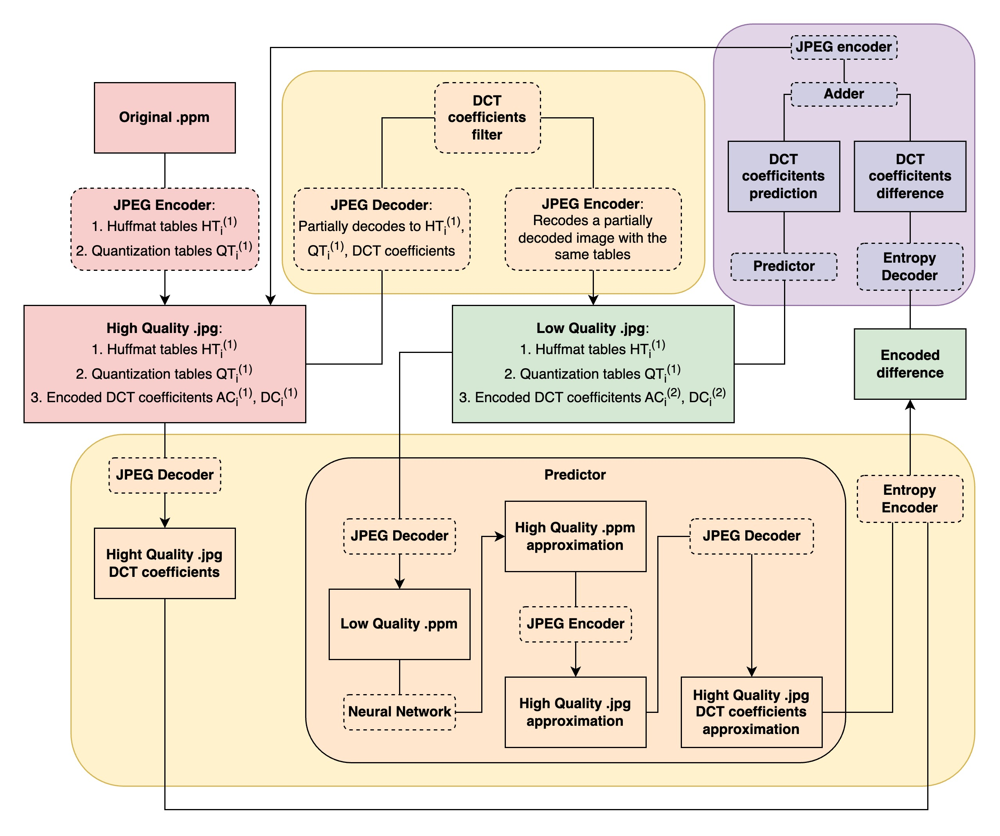

# Transcoding JPEG images

A research project on the topic "Transcoding JPEG images using prediction of DCT coefficients based on a neural network". Repository structure:
- `src/*`, `include/*` - the source code of the JPEG encoder and decoder;
- `CMakeLists.txt` - makefile containing project structure;
- `models/model.ipynb` - the Jupiter notebook in which the DCT coefficients are processed.

## Overview

Transcoder scheme:

The steps of trans-coding:
1. The JPEG decoder extracts Huffman tables, quantization tables, channel descriptions and discrete cosine transform (DCT) coefficients from the encoded image;
2. DCT coefficients are filtered, namely, a random subset of AC coefficients is removed;
3. The decoder recodes the image using the same tables, but filtered DCT coefficients;
4. The neural network tries to restore the original image from the corrupted image and receives approximate values of the deleted DCTcoefficients;
5. The difference between approximate coefficients and real coefficients is encoded using an entropy encoder.

The steps of trans-decoding:
1. The neural network builds an approximation of the original image based on the corrupted image;
2. The entropy decoder restores the coefficient difference between the approximate image and the original one;
3. The difference of the coefficients is added to the coefficients of the approximate image.
