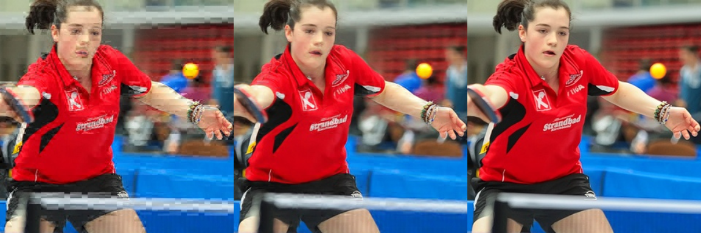
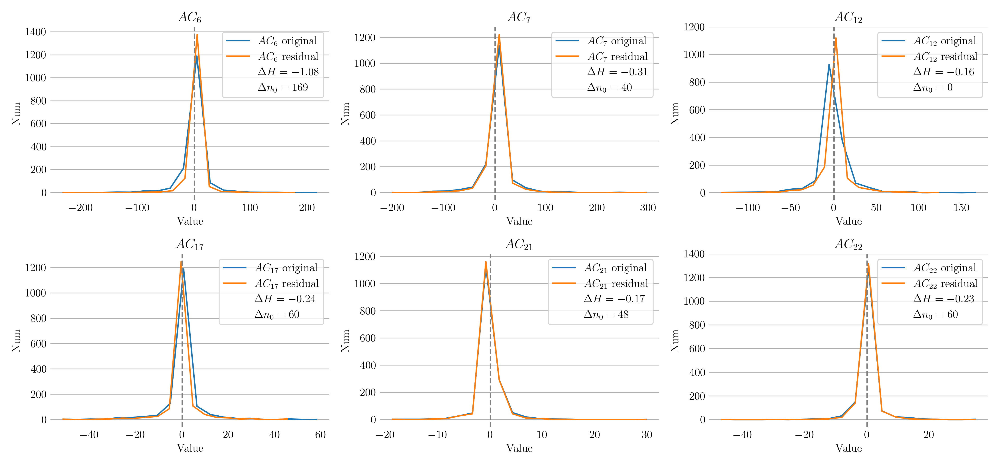

# Результаты экспериментов

### Содержание
- [Набор данных](#набор-данных)
- [Параметры обучения](#параметры-обучения)
- [Оценка качества работы нейронной сети](#оценка-качества-работы-нейронной-сети)
  - [Визуальная оценка](#визуальная-оценка)
  - [Сравнение распределений](#сравнение-распределений)
- [Оценка степени сжатия](#оценка-степени-сжатия)

## Набор данных

Для обучения нейронной сети было взято 50'000 случайных изображений из набора данных [ImageNET](https://www.image-net.org/), из которых 5'000 было выделено для тестирования модели, 10'000 — для валидации и оставшиеся 35'000 — для обучения. Изображения были обрезаны до размера $320\times320$ пикселей, после чего в каждом блоке $8\times8$ пикселей было обнулено по 16 псевдослучайных AC-коэффициентов.

## Параметры обучения

Обучение производилось на персональном компьютере MacBook Pro 2021 г. (чип Apple M1 Pro) на основании функции ошибки MSE (`torch.nn.MSELoss`) с использованием оптимизатора Adam (`torch.optim.Adam`) с параметром `lr=1e-4` (learning rate или скорость обучения) на протяжении 100 эпох. После каждой эпохи рассчитывалась метрика MSE на валидационном наборе данных. Наименьшее значение функции ошибки было достигнуто по завершении последней эпохи и составило $1,405\mathrm{e}{-3}$.

## Оценка качества работы нейронной сети

### Визуальная оценка

Рисунок 1 иллюстрирует, как обученная модель справляется с искажениями, которые были внесены в результате обнуления коэффициентов. На примере видно, что большая часть видимых артефактов устранена. Так, например, на левом изображении практически на всех участках четко видно деление на блоки, а после нейросетевой обработки подобных артефактов уже не остается. Таким образом, визуально заметно, что нейросети удается приближенно восстанавливать обнуленные ДКП коэффициенты.

  

  <b>Рисунок 1</b>: Пример работы обученной модели

### Сравнение распределений

Графики на рисунке 2 показывают сравнение распределений ошибок предсказания коэффициентов ДКП (residuals) на позициях обнуленных коэффициентов и самих этих коэффициентов для позиций 6, 7, 12, 17, 21 и 22 (означающих индексы AC-коэффициентов при сканировании в зигзагообразном порядке). Видно, что ошибки предсказания сконцентрированы ближе к нулю, чем сами коэффициенты. Следовательно, число ненулевых кодируемых энтропийным кодером значений сокращается, а их абсолютные значения уменьшаются. На основании этого можно сделать вывод о том, что их энтропия снижается (что и показывают рассчеты, см. значения $\Delta H$ на графиках) и итоговый объем битового потока должен быть меньше.

  

  <b>Рисунок 2</b>: Сравнение распределений коэффициентов и ошибок их предсказания

## Оценка степени сжатия

Оценка качества работы транскодера выполнялась на упомянутом выше тестовом наборе данных. Были рассмотрены следующие варианты транскодирования изображений (результаты экспериментов представлены в таблице):
1. [_Предобученная модель_](https://gitlab.actcognitive.org/aivideocoding/aivideoenhancement) — метод транскодирования, использующий для внутреннего предсказания модель QE-CNN-P обученную для визуального повышения качества видео, закодированных кодеком HEVC;
2. _Предложенный 1_ (CNN-based) — метод транскодирования на внутреннего предсказания с помощью обученной в рамках разработки данной библиотки модели машинного обучения;
3. _Jpegtran_;
4. _Предложенный 2_ (CNN-based + Jpegtran) — комбинация предложенного 1 и Jpegtran;
5. _LLJPEG_;
6. _Предложенные 3_ (CNN-based + LLJPEG) — комбинация предложенного 1 и LLJPEG.

<table border="1">
  <tr>
    <th>Методы</th>
    <th>Среднее</th>
    <th>Медиана</th>
    <th>Стандартное отклонение</th>
    <th>По всему набору данных</th>
  </tr>
  <tr>
    <td>Предобученная модель</td>
    <td>2,57</td>
    <td>2,68</td>
    <td>0,87</td>
    <td>2,76</td>
  </tr>
  <tr>
    <td>Предложенный 1</td>
    <td>3,33</td>
    <td>3,38</td>
    <td>0,54</td>
    <td>3,38</td>
  </tr>
  <tr>
    <td>Jpegtran</td>
    <td>10,05</td>
    <td>10,00</td>
    <td>3,06</td>
    <td>10,12</td>
  </tr>
  <tr>
    <td>Предложенный 2</td>
    <td>13,16</td>
    <td>13,11</td>
    <td>2,91</td>
    <td>13,18</td>
  </tr>
  <tr>
    <td>LLJPEG</td>
    <td>16,14</td>
    <td>15,49</td>
    <td>3,37</td>
    <td>15,59</td>
  </tr>
  <tr>
    <td>Предложенный 3</td>
    <td>15,44</td>
    <td>15,08</td>
    <td>2,61</td>
    <td>15,14</td>
  </tr>
</table>

<b>Таблица</b>: Сравнение степени сжатия, %

Результаты эксперимента показывают, что обученная в рамках разработки данной библиотки нейронная сеть сжимает тестовый набор изображений на 3,38% (в отличие от предобученной нейронной сети с такой же архитектурой, но решающей иную задачу). Также из таблицы видно, что предлагаемый метод предсказания коэффициентов ДКП хорошо комбинируется с Jpegtran, позволяющим заменить код Хаффмана на арифметический код. Степени сжатия, наблюдаемые при использовании каждого из этих подходов, фактически суммируются, если использовать методы совместно (2-й предложенный метод).

Несмотря на то, что на практике транскодер LLJPEG показывает наилучшие результаты, 2-й предложенный метод отстает от него всего на 2,41% (при рассмотрении сжатия всего тестого набора данных в целом). При этом в данной комбинации реализовано только предсказание AC-коэффициентов и улучшение энтропийного кодера благодаря использованию арифметического кодирования, что необходимо учитывать при сравнении эффективности работы двух данных подходов.
