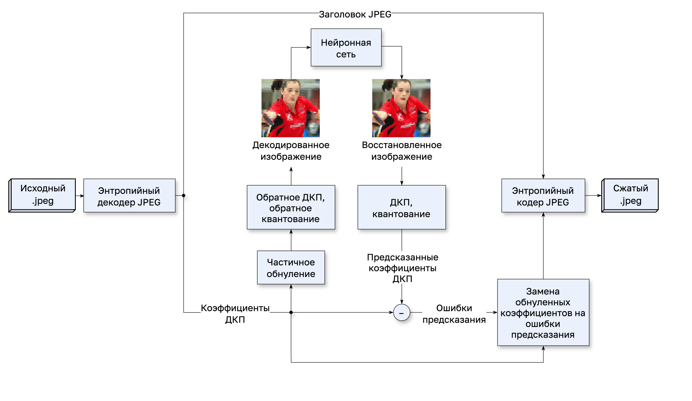
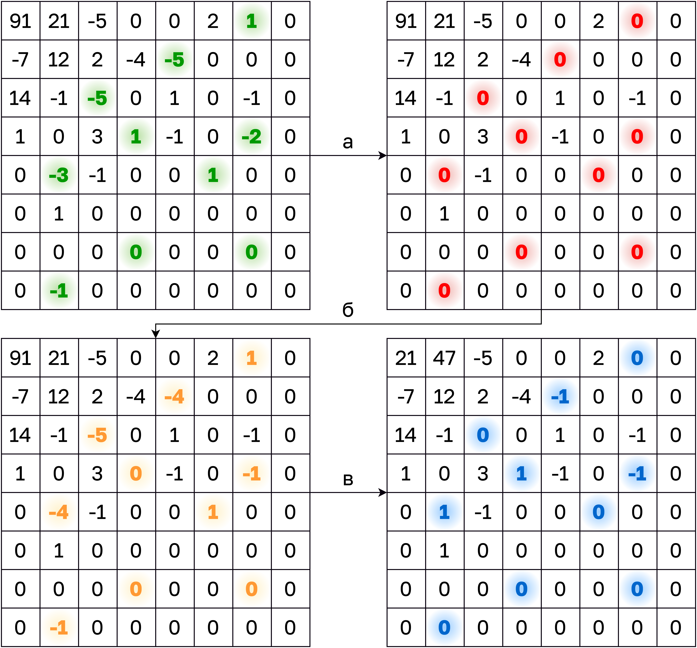
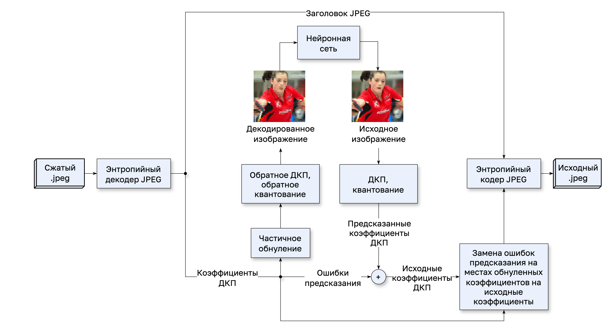
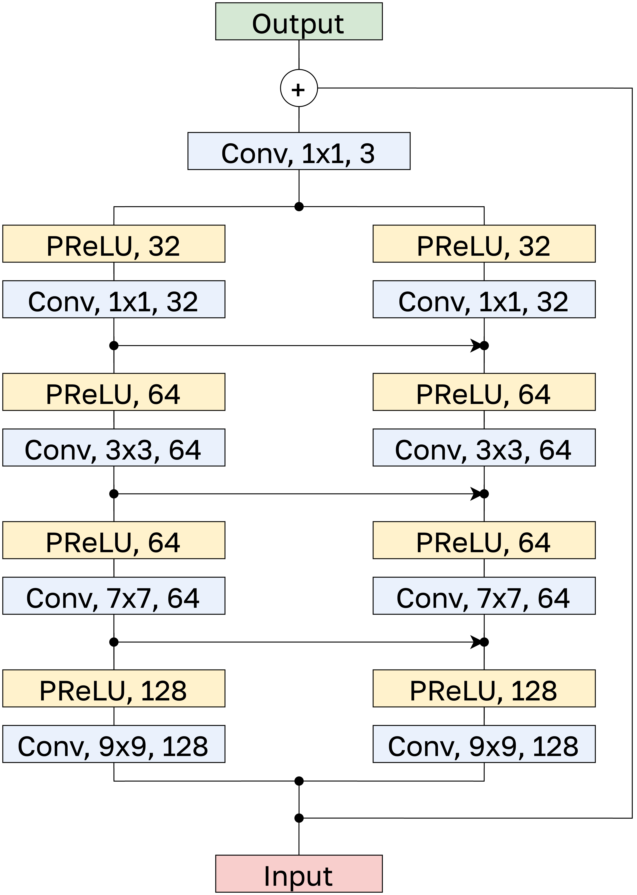

# Как это работает

### Содержание
- [Транскодирование](#транскодирование)
- [Трансдекодирование](#трансдекодирование)
- [Восстановление коэффициентов](#восстановление-коэффициентов)

## Транскодирование

Общая схема транскодера представлена на данном рисунке:

<div align="center">
  
</div>

При транскодировании к исходному изображению $I$ применяется энтропийный декодер JPEG, а затем из него извлекаются квантованные коэффициенты ДКП. Далее они делятся псевдослучайным образом на две группы и коэффициенты первой группы обнуляются (операция "а" на рисунке).

<div align="center">
  
</div>

После обнуления блока к оставшимся коэффициентам применяется обратное квантование и обратное ДКП, и изображение переводится в цветовое пространство RGB. Таким образом, фактически выполняется стандартное декодирование JPEG, но изображение оказывается искаженным ($\tilde{I}$). Далее оно подается на вход нейронной сети $M$, которая обучена улучшать качество декодированных изображений. В области ДКП это означает, что на местах обнуленных коэффициентов $x_{i,j}$ первой группы в обработанном моделью изображении $I'=M(\tilde{I})$ появляются похожие на них коэффициенты $x'_{i,j}$ (операция "б" на рисунке). Таким образом, нейронная сеть предсказывает значения коэффициентов первой группы по коэффициентам из второй группы, то есть реализует внутреннее предсказание.

На следующем этапе все коэффициенты кодируются согласно алгоритму JPEG, однако вместо значений коэффициентов первой группы кодируется ошибка их предсказания $`\Delta x_{i,j}=x_{i,j}-x'_{i,j}`$ (операция "в" на рисунке). Если нейронной сети удается в точности восстанновить обнуленный коэффициент ($`x'_{i,j}=x_{i,j}`$), то вместо него в блоке остается ноль, в противном случае коэффициент заменяется меньшим по модулю значением. Таким образом, достигается дополнительное сжатие JPEG-изображения.

## Трансдекодирование

Схема трансдекодера представлена на рисунке ниже и аналогична схеме транскодера. При декодировании создается изображение $\tilde{I}$, у которого удалены те же самые коэффициенты, что и при кодировании. Оно подается на вход нейронной сети $M$ и на месте обнуленных коэффициентов появляются значения $x'$, к которым остается только добавить поправку $\Delta x$, закодированную на местах обнуленных коэффициентов. В результате получаются $x = x' + \Delta x$ — исходные значения коэффициентов ДКП, которые далее кодируются энтропийным кодером JPEG.

<div align="center">
  
</div>

## Восстановление коэффициентов

Для предсказания коэффициентов ДКП используется архитектура [QE-CNN-P](http://dx.doi.org/10.1109/TCSVT.2018.2867568}) (Quality Enhancement Convolutional Neural Network), имеющая девять слоев, но способная искать сложные искажения изображения и устранять их. Она представлена на рисунке ниже.

<div align="center">
  
</div>

Каждый ее слой состоит из свертки, сохраняющей размерность тензора, и функции активации $PReLU$ с числом параметров равном числу фильтров в свертке. Математически данная архитектура может быть выражена следующим образом:
```math
    PReLU_i(x) = \max(0, x) + a_i \cdot \min(0, x),
```
```math
    F_0(Y) = Y,
```
```math
    F_i(Y) = PReLU_i(W_i * F_{i-1}(Y) + B_i),\quad i \in \{1, 2, 3, 4\},
```
```math
    F_5(Y) = PReLU_5(W_5 * F_0(Y) + B_5),
```
```math
    F_i(Y) = PReLU_i(W_i * (F_{i-5}(Y) \oplus F_{i-1}(Y)) + B_i),\quad i \in \{6, 7, 8\},
```
```math
    F_9(Y) = W_9 * (F_4(Y) \oplus F_8(Y)) + B_9,
```
где $a_i$ — обучаемый параметр функции активации $ReLU_i$, представляющий из себя вектор значений, а "$`\oplus`$" означает конкатенацию тензоров.
